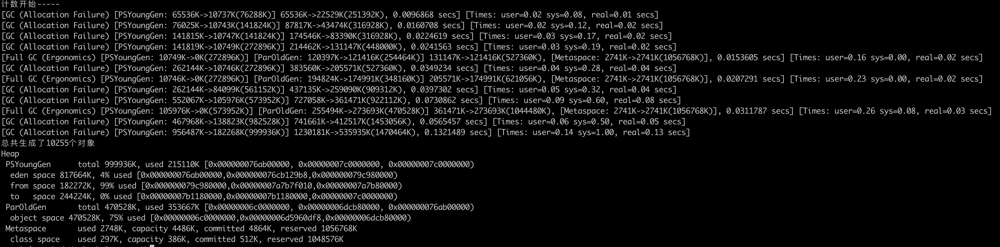
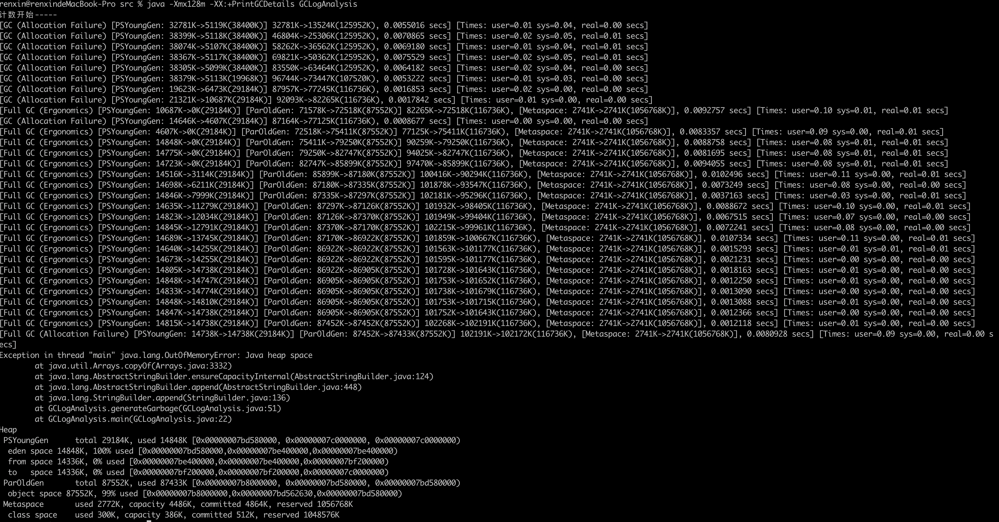
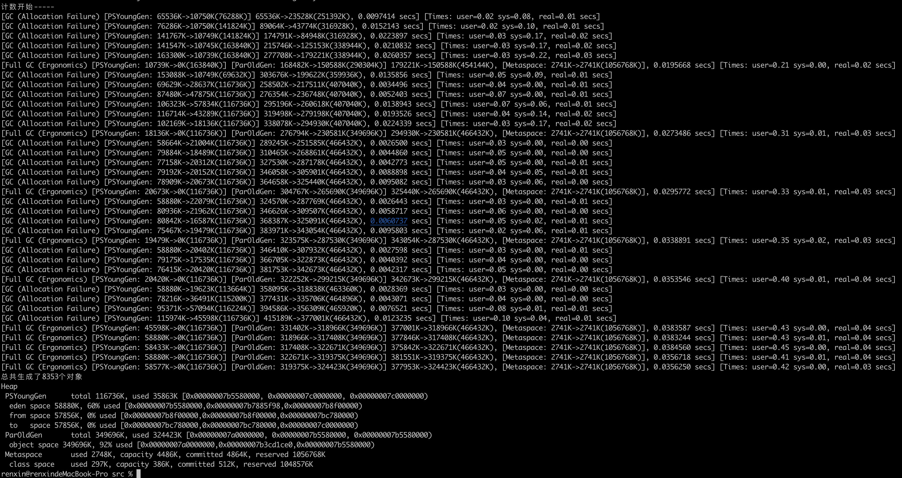
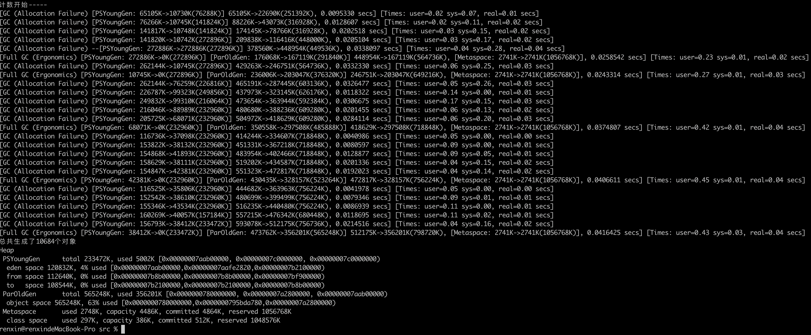
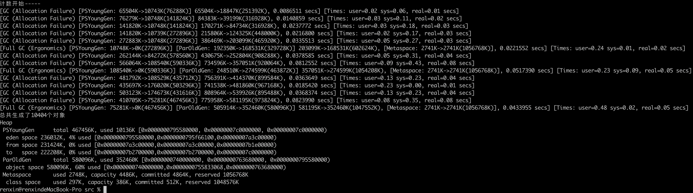

# 运行结果
`java -XX:+PrintGCDetails GCLogAnalysis`

`java -Xloggc:gc.demo.log -XX:+PrintGCDetails -XX:+PrintGCDateStamps GCLogAnalysis`

`java -Xmx128m -XX:+PrintGCDetails GCLogAnalysis`

`java -Xmx512m -XX:+PrintGCDetails GCLogAnalysis`

`java -Xmx1g -XX:+PrintGCDetails GCLogAnalysis`

`java -Xmx2g -XX:+PrintGCDetails GCLogAnalysis`

## Serical 、Parallel、CMS 对比

`java -XX:+UseSerialGC -Xmx512m -Xms512m -Xloggc:gc.512m.serial.log -XX:+PrintGCDetails -XX:+PrintGCDateStamps GCLogAnalysis`

`java -XX:+UseParrllelGC -Xmx512m -Xms512m -Xloggc:gc.512m.parallel.log -XX:+PrintGCDetails -XX:+PrintGCDateStamps GCLogAnalysis`

`java -XX:+UseConcMarkSweepGC -Xmx512m -Xms512m -Xloggc:gc.512m.cms.log -XX:+PrintGCDetails -XX:+PrintGCDateStamps GCLogAnalysis`

### 结论：

相同GC不同堆大小：

随着堆内存的逐渐增大，垃圾回收暂停时间越来愈长，但业务吞吐量在增长

相同堆大小不同GC：

GC时间：CMS < Parallel < Serial

业务吞吐量：CMS > Serial > Parallel

## G1 和CMS对比

`java -XX:+UseConcMarkSweepGC -Xmx512m -Xms512m -Xloggc:gc.512m.cms.log -XX:+PrintGCDetails -XX:+PrintGCDateStamps GCLogAnalysis`

`java -XX:+UseG1GC -Xmx512m -Xms512m -Xloggc:gc.512m.g1.log -XX:+PrintGCDetails -XX:+PrintGCDateStamps GCLogAnalysis`

### 结论

512M堆时：G1 业务吞吐量略高于CMS

1G堆时：G1 业务吞吐量略高于CMS

4G堆时：G1 业务吞吐量略高于CMS

